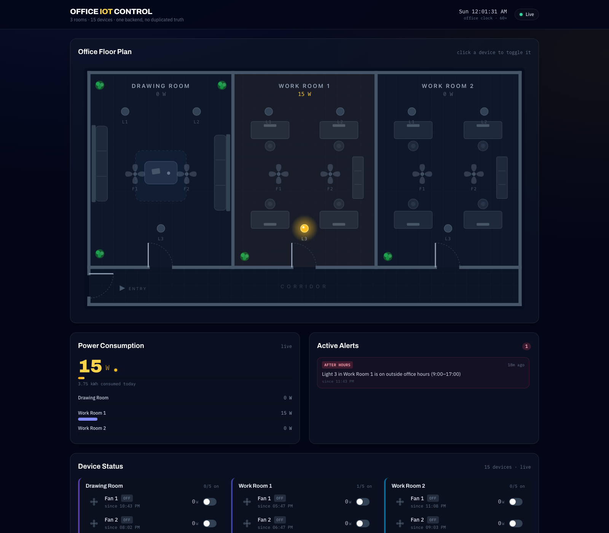
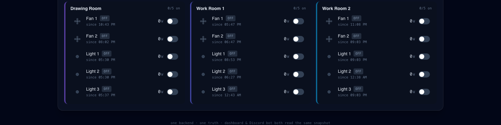

# Office IoT Dashboard

Smart office energy monitoring for a 3-room office that runs on Discord.
15 simulated devices (6 fans + 9 lights, 5 per room) feed **one backend**,
which powers a **live web dashboard** and a **Discord bot** — both thin,
read-only clients of the same source of truth. No polling anywhere: the
dashboard updates over Socket.IO the instant a device changes, and the bot's
proactive alerts fire the instant the backend's alert engine detects one.

> Techathon Nationals & Rover Summit (IUT Robotics Society) — preliminary
> round submission.

```
[Device Simulator] -> [Backend API + Socket.IO] -> [Web Dashboard]
                                                -> [Discord Bot] -> users
```



## Quick start

Requires **Node.js 20+** and npm.

```bash
npm install
cp .env.example .env
npm run dev:backend    # REST + Socket.IO on :4000 — start this first
npm run dev:dashboard  # Vite dev server on :5173
npm run dev:bot        # Discord bot — needs DISCORD_BOT_TOKEN in .env, see below
```

Open **http://localhost:5173** for the dashboard. The backend seeds all 15
devices off and starts a simulated office day at 09:00 — office-hours open,
so a fresh start shows a clean "no active alerts" state (see `.env.example` —
`SIM_START_TIME`), running 60× real time so a few minutes of wall-clock
time covers a full office day, including after-hours and early-morning
behavior.

### Discord bot credentials

The bot builds and runs without any keys, but needs two things to actually
connect and (optionally) speak in nicer prose:

1. **`DISCORD_BOT_TOKEN` (required to run at all):** [Discord Developer
   Portal](https://discord.com/developers/applications) → New Application →
   *Bot* tab → Reset Token → copy it. Under **Privileged Gateway Intents**,
   enable **Message Content Intent** (the bot can't read `!status` etc.
   without it). Then *OAuth2 → URL Generator* → scope `bot` → permissions
   `Send Messages`, `Read Message History`, `View Channel` → open the
   generated URL and invite the bot to a server you control.
2. **`ANTHROPIC_API_KEY` (optional):** [console.anthropic.com](https://console.anthropic.com)
   → API Keys → Create Key. Without it the bot replies with clean,
   deterministic template text instead of LLM-phrased prose — it never goes
   silent either way.
3. **`DISCORD_ALERT_CHANNEL_ID` (optional):** right-click a channel in
   Discord (Developer Mode on) → Copy Channel ID. Enables proactive alert
   posts; without it the bot just skips that feature.

Paste all three into `.env` (never into chat, never committed — `.env` is
gitignored).

### Demo controls

The backend's simulator runs on its own, but for a live demo you don't want
to wait on dice — three scenario endpoints let you trigger every alert path
on command:

```bash
# Force a room to look "forgotten" — all 5 devices on, ignores the normal cycle
curl -X POST localhost:4000/api/demo/scenario -H 'content-type: application/json' \
  -d '{"name":"forget","room":"work2"}'

# Jump the simulated office clock forward (HH:MM, 24h)
curl -X POST localhost:4000/api/demo/scenario -H 'content-type: application/json' \
  -d '{"name":"jump","time":"17:30"}'

# All devices on / all devices off
curl -X POST localhost:4000/api/demo/scenario -H 'content-type: application/json' -d '{"name":"all-on"}'
curl -X POST localhost:4000/api/demo/scenario -H 'content-type: application/json' -d '{"name":"all-off"}'
```

`forget` + `jump` together reproduce the exact scenario from the problem
statement — a room still fully on well after hours — and trip both alert
rules (after-hours, and all-on-for-over-2-hours) at once.

### Testing the API yourself

Prefer clicking over typing curl commands? Import
[`docs/postman_collection.json`](docs/postman_collection.json) into Postman
(File → Import) — every endpoint is in there (health, devices, rooms,
alerts, toggle, the demo scenarios above) pre-filled and ready to send
against `http://localhost:4000`, no setup beyond having the backend running.

## Repo layout

```
apps/backend/     Express + Socket.IO + device simulator — the single source of truth
apps/dashboard/   React + Vite + Tailwind live dashboard
apps/bot/         discord.js bot (!status, !room, !usage, proactive alerts)
packages/shared/  Types + alert rules shared by every surface — evaluated once, in the backend
docs/             Diagrams, hardware design, demo script, original problem PDF
hardware/         Wokwi circuit simulation (ESP32 + relays + current sense)
```

## What each panel shows

- **Live Device Status Panel** — all 15 devices, grouped by room, on/off pill
  + live wattage + toggle switch per device.
- **Live Power Consumption Meter** — total office wattage right now, kWh
  consumed today, and a per-room breakdown bar.
- **Active Alerts Panel** — devices left on outside 9AM–5PM office hours, or
  a room where every device has been running continuously for over 2 hours.
  Both rules live once in `packages/shared` and are evaluated only by the
  backend; the dashboard and bot both just render its output.
- **Animated office map** *(bonus)* — top-view floor plan; lights glow amber
  when on, fans spin when running, rooms tint warmer as more lights come on.
  Click any device to toggle it — the click goes out as a real API call.



## Documentation

- System diagram: [`docs/diagrams/system-diagram.svg`](docs/diagrams/system-diagram.svg)
  (full data flow: simulator → backend → dashboard/bot → users, with push
  vs. pull paths distinguished)
- Hardware / circuit design: [`docs/HARDWARE.md`](docs/HARDWARE.md) +
  [`hardware/`](hardware/) — importable Wokwi project (ESP32, 5 relays, wall
  switches, current-sense stand-in) with a full pin-mapping table
- Demo script: [`docs/DEMO_SCRIPT.md`](docs/DEMO_SCRIPT.md)
- API testing: [`docs/postman_collection.json`](docs/postman_collection.json) — import into Postman, every endpoint ready to send
- Demo video: *(link pending)*
- Original problem statement: [`docs/original-problem-statement.pdf`](docs/original-problem-statement.pdf)
- Build plan and decisions log: [`PLAN.md`](PLAN.md)

## Architecture notes

- **One backend, one truth.** The dashboard and bot never compute their own
  view of device state, power totals, or alerts — both read the backend's
  `Snapshot` (REST `/api/summary`, or pushed over Socket.IO as `snapshot`).
- **Alert rules exist in exactly one place** (`packages/shared/src/alerts.ts`),
  evaluated only by the backend. The dashboard's Alerts Panel and the bot's
  proactive push both consume the backend's computed list.
- **The bot never invents numbers.** Every reply is built from a
  deterministic template first; an optional LLM call only rephrases that
  template into friendlier prose, and any failure (missing key, API error)
  falls back to the template untouched.
- **Simulated clock, not wall clock.** `SIM_TIME_SCALE` (default 60×) lets a
  few minutes of real time cover office hours, evenings, and early mornings,
  so both alert rules are demonstrable without waiting on real time.
